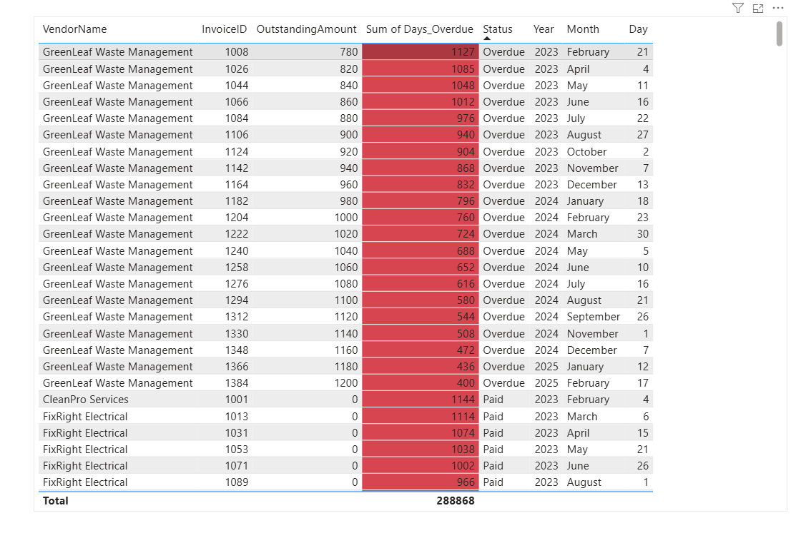

# AP-Aging-Dashboard

# Accounts Payable Aging Dashboard  
**Power BI Project – Vendor Risk & Overdue Analysis**

## 📌 Business Problem  
The company lacked visibility into overdue invoices, outstanding amounts, and the distribution of invoices across aging buckets.  
Management needed a clear, visual overview to identify payment risks, prioritize vendor follow‑ups, and support decision‑making.

---

## 📌 Solution  
I built a multi‑page Accounts Payable dashboard in Power BI that provides:

- Total outstanding and overdue amounts  
- Aging bucket distribution  
- Vendor‑level overdue analysis  
- Invoice‑level risk breakdown with conditional formatting  

Data was cleaned and transformed in **Power Query**, and key KPIs were calculated using **DAX**.  
The dashboard supports fast, actionable insights for AP teams and finance managers.

---

## 📌 Key Insights  

### **1. Overdue Exposure**
- 100% of the outstanding amount is overdue, indicating immediate action is required.

### **2. Vendor Risk Concentration**
- The majority of overdue balance is linked to a single vendor, while others show minimal risk.
- This enables targeted follow‑up instead of broad, unfocused chasing.

### **3. Aging Bucket Distribution**
- Most outstanding amount sits in the **Not Due** category (0.24M).
- Only 0.01M falls into the 0–30 days bucket.
- The issue is not widespread — it is concentrated in a few high‑value invoices.

### **4. Invoice‑Level Risk**
- GreenLeaf Waste Management shows multiple invoices overdue by **400–1100+ days**.
- The color‑coded table highlights the highest‑risk items for immediate escalation.

---

## 📌 Tools & Techniques  
- Power BI  
- Power Query  
- DAX  
- Data Modelling  
- KPI Design  
- Conditional Formatting  
- Financial Analysis (AP Aging)

---

## 📌 Project Files  
- Power BI (.pbix)  
- Dataset (CSV/Excel)  
- Screenshots of dashboard pages  

## 📸 Dashboard Screenshots

### Aging Analysis

### Aging Bucket Distribution

### Overdue Amount by Vendor

### Invoice Table

